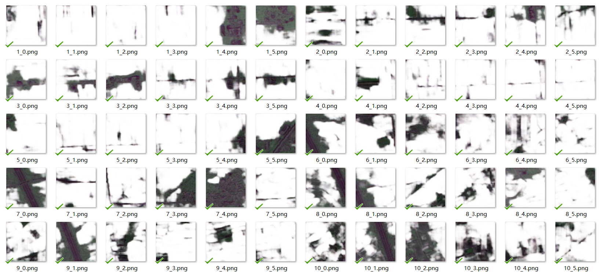

1. 将数据文件夹格式改为

- root-data-dir

  -train

  ​	-mask

  ​	-ori

  -val

  ​	-mask

  ​	-ori

  -test

  ​	-mask

  ​	-ori

2. 对数据图片进行分割500*600->5\*6\*(100\*100)，打开```图像切割还原-彩色.ipynb```，将分割图片下的```dir```修改为所处理的图片的目录文件的列表，然后运行。会生成得到```len(dir)```个文件夹在当前目录，命名为```0,1,2...len(dir)-1```。

3. 修改```config.py```中的函数路径，

   ```python
   ROOT = '/content'#根路径
   DATA_DIR = '/content/drive/MyDrive/mathcup/B/processed' #数据集路径
   experiment_dir = ROOT + '/sdh/exper_info/' + cur_time #保存训练数据的路径
   ```

4. 修改```main.py```中的路径，第44行-第52行。

```python
# get the cover and mask 
train_dir = os.path.join(config.DATA_DIR,'train')# 训练文件夹
val_dir = os.path.join(config.DATA_DIR,'val') # 测试文件夹

train_cover_dir =os.path.join(train_dir,'ori') #训练用ori图片
train_mask_dir = os.path.join(train_dir,'mask') # 训练用mask图片

val_cover_dir =os.path.join(val_dir,'ori')#测试用ori图片
val_mask_dir = os.path.join(val_dir,'mask')#测试用mask图片
```

5. 运行```main.py```，checkpoint会保存```val_diff```，也就是验证mask与生成的验证mask最小差距的权重文件。

```
! python3 main.py
```

6. 预测，修改```predict.py```并运行

```python
test_dir="/content/drive/MyDrive/mathcup/B/processed/test"# 27行，修改为测试使用的数据集目录
checkpoint=torch.load("/content/sdh/exper_info/2021-01-19_11-56/checkpoint/checkpoints_best.pth.tar")#修改为5中得到的权重文件路径
```


7. 得到形如这样的图片




8. 修改并运行```图像切割还原-彩色.ipynb```中的恢复图片模块

```
dir修改为需要还原的图像文件夹
得到listpath为需要还原的所有文件
```

```python
imgh=None
imgv=None
imgs=None
for i in range(2):#修改2为需要保存的总的个数，test图片为2，所以这里是2
  for j in range(5):
    for k in range(6):
      print(listpath[i*30+j*6+k])
      print(图片所在路径+listpath[i*30+j*6+k])
      img =cv2.imread(图片文件所在路径+listpath[i*30+j*6+k])
      img = cv2.resize(img, (100, 100))
      if k==0:
        imgh=img
      else:
        imgh=cv2.hconcat([imgh,img])#水平拼接
    if j==0:
      imgv=imgh
    else:  
      imgv=cv2.vconcat([imgv,imgh])#水平拼接
  
  cv2.imwrite(str(i)+".png",imgv)#保存到当前路径
  imgv=None
```

9. 根据生成图片，人工确定最佳阈值。```图像切割还原-彩色.ipynb```中的阈值过滤噪声，选择最优化图像
10. 对耕地面积进行统计。```图像切割还原-彩色.ipynb```中的统计耕地面积。注意修改路径。
11. 转换选择的阈值图片为```0~1```的```tif```图像。```图像切割还原-彩色.ipynb```中的统计新的耕地面积。注意修改路径。
12. 修改```dropout```进行对比：修改文件```network.py```第80行，默认参数```dropout```修改为```True```就可以在模型中运行```dropout```层。
13. 在```画图.ipynb```中，修改对应的路径为有```dropout```和没有```dropout```的```loss_diff.csv```的路径，并运行，可以得到对比图像。图像的保存路径为当前路径。需要手动拷贝到保存路径。

```python
with_drop=pd.read_csv("/content/drive/MyDrive/mathcup/sdh/exper_info/2021-01-19_17-12_with_dropout/loss_diff.csv")
without_drop=pd.read_csv("/content/drive/MyDrive/mathcup/sdh/exper_info/2021-01-19_17-33_without_dropout/loss_diff.csv")
```


